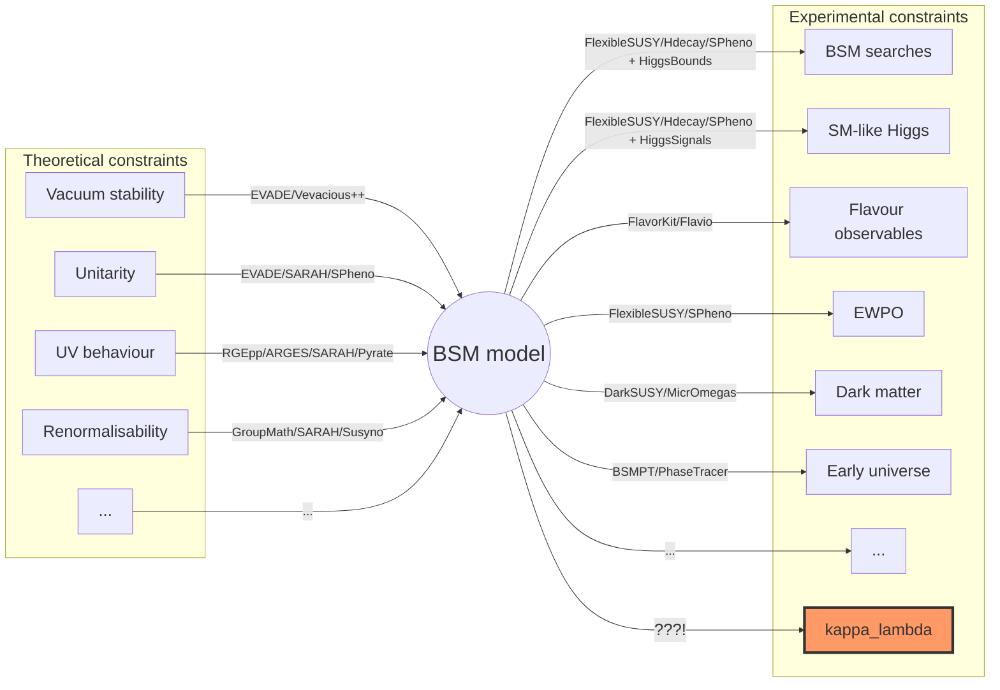

# anyBSM / anyH3: $`\kappa_\lambda`$ (and more) in generic BSM models

[](https://gitlab.com/anybsm/anybsm/commits/main) 
[](https://gitlab.com/anybsm/anybsm/commits/main)


<div align="center">

{width=40% height=40%}

</div>

## program purpose
The idea of this program is to close tha gap regarding $`\kappa_\lambda`$ predictions in the landscape of BSM tool-boxes:

## Installation
### Using pip (recommended)
```bash
pip install -U anyBSM
```

### from source
```bash
git clone https://gitlab.com/anybsm/anybsm.git
cd anybsm
pip install .
```

## Documentation

An online documentation is available at [anybsm.gitlab.io](https://anybsm.gitlab.io).

[pdoc](https://pdoc.dev) is required to generate the documentation locally:
```
pip3 install pdoc
./docs/make.py
# now open /docs/docs/index.html in your browser
```

## Journal references

Henning Bahl, Johannes Braathen, Martin Gabelmann, Georg Weiglein
<br/>*anyH3: precise predictions for the trilinear Higgs coupling in the Standard Model and beyond*  </br>                      
e-Print: [arXiv:2305.03015](https://arxiv.org/abs/2305.03015)

## program flow

### program structure

<div align="center">

{width=90% height=90%}

</div>

### class structure 

<div align="center">

{width=80% height=80%}

</div>
