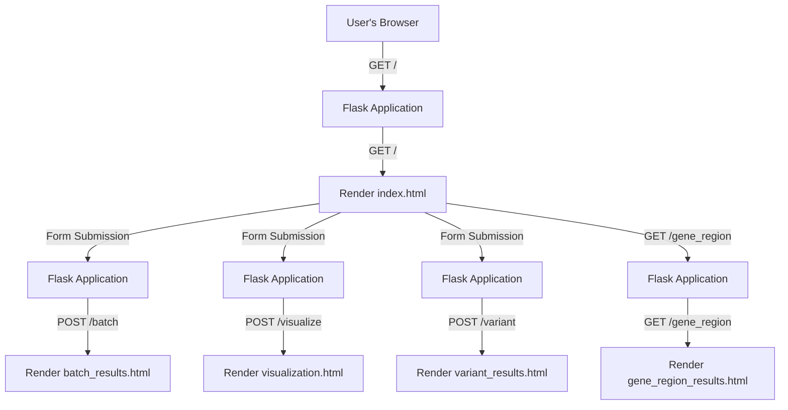

# Ensembl Variant Lookup

`Ensembl Variant Lookup` provides a web-based graphical interface, allowing users to retrieve information about genetic variants based on their Reference SNP ID (RSID). This application integrates with the Ensembl Variant API to provide detailed variant information.

# Overview

`Ensembl Variant Lookup` is a Python tool built with Flask that allows users to query and retrieve information about genetic variants from the Ensembl database. It provides a user-friendly interface for searching individual variants, batch queries, and exploring gene regions. The tool is designed to streamline the retrieval of essential genetic variant data, making it a valuable resource for genomics research and exploration.

## Features

-   **Single Variant Lookup:** Retrieve detailed information about a specific genetic variant using its RSID.
-   **Batch Variant Lookup:** Perform batch searches by entering a list of RSIDs and obtaining information for multiple variants simultaneously.
-   **Gene Lookup:** Fetch information about a specific gene, including details on associated variants.

Simplified illustration at high-level of API exposed in thie application, it includes all the API endpoints in the diagram:



This flowchart now includes the following API endpoints:

- `/batch` (POST): Batch search for variants by rsid list.
- `/variant` (POST): Search for variants by rsid.
- `/gene_region` (GET): Search for variants in a gene region.
- `/visualize` (POST): Visualize variants for a specific gene.

## Installation

Use `pip` to install the Ensembl Variant Lookup package.

``` bash
pip install ensembl-variant-lookup
```

## Usage

1.  **Run the Application:**

    ``` bash
    ensembl-variant-lookup
    ```

    This command starts the Flask development server, and you can access the application at `http://localhost:5000` in your web browser.

2.  **Access the Web Interface:**

    Open your web browser and navigate to <http://localhost:5000> to use the Ensembl Variant Lookup tool.

3.  **Single Variant Lookup:**

    -   Enter a specific RSID in the provided form.
    -   Click the "Fetch Variant" button to retrieve detailed information for the specified genetic variant.

4.  **Batch Variant Lookup:**

    -   Enter a list of RSIDs (comma-separated) in the batch search form.
    -   Click the "Batch Search" button to obtain information for multiple variants simultaneously.

5.  **Gene Lookup:**

    -   Enter the gene name in the gene lookup form.
    -   Click the "Fetch Gene Info" button to retrieve details about the specified gene.

## Screenshots


***Caption 1:*** *Screenshot of the Home Page.*

---


***Caption 2:*** *Screenshot of the Single Variant Lookup interface.*

---


***Caption 3:*** *Screenshot of the Batch Variant Lookup interface.*

---


***Caption 4:*** *Screenshot of the Gene Lookup interface.*

---


## Contributing

If you would like to contribute to this project, please contact or leave here an issue [issue](https://github.com/danymukesha/ensembl-variant-lookup/issues)
