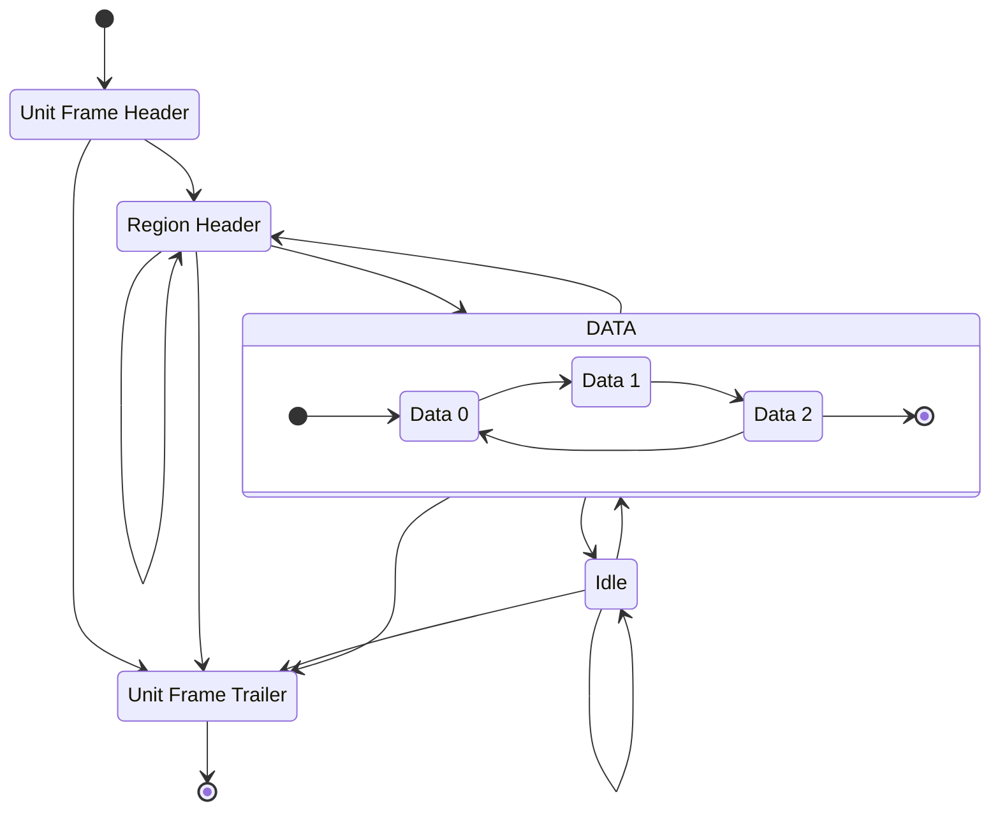
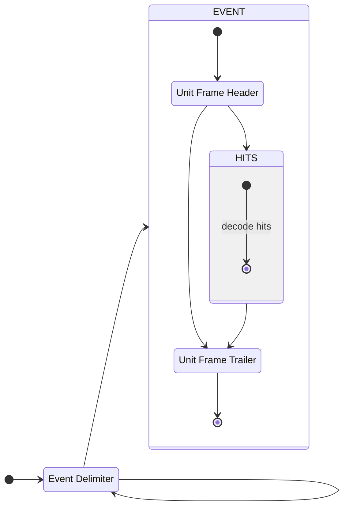
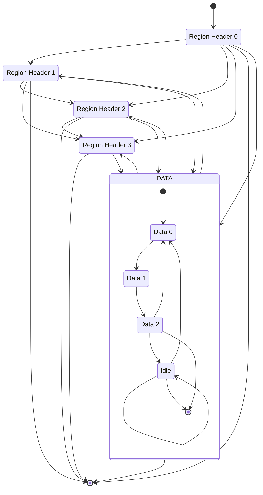

# MOSS Decoder
[](https://github.com/CramBL/moss_decoder/actions/workflows/CI.yml)


Python package implemented in Rust for high-performance decoding of readout data from the MOSS chip (Stitched Monolithic Pixel Sensor prototype).

- [MOSS Decoder](#moss-decoder)
  - [Installation](#installation)
    - [Example](#example)
  - [Features](#features)
    - [5 types of idempotent functions are provided](#5-types-of-idempotent-functions-are-provided)
  - [MOSS event data packet protocol FSM](#moss-event-data-packet-protocol-fsm)
  - [MOSS event data packet decoder FSM](#moss-event-data-packet-decoder-fsm)
  - [Event packet hit decoder FSM](#event-packet-hit-decoder-fsm)
  - [Running tests](#running-tests)
    - [Testing local changes](#testing-local-changes)
  - [Motivation \& Purpose](#motivation--purpose)
  - [@CERN Gitlab installation for CentOS and similar distributions from local build](#cern-gitlab-installation-for-centos-and-similar-distributions-from-local-build)
    - [Troubleshooting](#troubleshooting)

## Installation
```shell
$ pip install moss-decoder
```
Import in python and use for decoding raw data.
### Example
```python
import moss_decoder

moss_packet = moss_decoder.decode_from_file("path/to/raw_data.raw")
print(moss_packet[0])
# Unit ID: 6 Hits: 44
#  [MossHit { region: 0, row: 3, column: 11 }, MossHit { region: 0, row: 18, column: 243 }, ...
print(moss_packet[0].hits[0])
# reg: 0 row: 3 col: 11
```

## Features
See [python types](moss_decoder.pyi) for the type information the package exposes to Python.

Two classes are provided: `MossPacket` & `MossHit`.

### 5 types of idempotent functions are provided
```python
decode_event(arg: bytes)  -> tuple[MossPacket, int]: ...
# allows decoding a single event from an iterable of bytes
```

**Returns**: the decoded `MossPacket` and the index the *unit frame trailer* was found. Throws if no valid `MossPacket` is found.
```python
decode_all_events(arg: bytes) -> tuple[list[MossPacket], int]: ...
# returns as many `MossPacket`s as can be decoded from the bytes iterable.
# This is much more effecient than calling `decode_event` multiple times.
```
**Returns**: A list of `MossPacket`s and the index of the last observed *unit frame trailer*. Throws if no valid `MossPacket`s are found or a protocol error is encountered.

```python
decode_from_file(arg: str | Path) -> list[MossPacket]: ...
# takes a `Path` and returns as many `MossPacket` as can be decoded from file.
# This is the most effecient way of decoding data from a file.
```
**Returns**: A list of `MossPacket`s. Throws if the file is not found, no valid `MossPacket`s are found, or a protocol error is encountered.

```python
decode_n_events(
    bytes: bytes,
    take: int,
    skip: Optional[int] = None,
    prepend_buffer: Optional[bytes] = None,
) -> tuple[list[MossPacket], int]: ...
# Decode N events from bytes
# Optionally provide either (not both):
#    - Skip M events before decoding N events
#    - Prepend a buffer before decoding N events.
```
**Returns**: A list of `MossPacket`s. Throws if the file is not found, no valid `MossPacket`s are found, or a protocol error is encountered.

A `BytesWarning` exception is thrown if the end of the `bytes` is reached while decoding a packet (no trailer is found)

```python
def skip_n_take_all(
    bytes: bytes, skip: int = None
) -> tuple[list[MossPacket], Optional[bytes]]: ...
# Decode all events, optionally skip N events first.
# return all decoded events and the remaining bytes after decoding the last MossPacket
```
**Returns**: All decoded events and any remaining bytes after the last trailer seen.

Using `decode_n_events` and `skip_n_take_all` it is possible to continuously decode multiple files that potentially ends or starts with partial events.

## MOSS event data packet protocol FSM
The a MOSS half-unit event data packet follows the states seen in the FSM below. The region header state is simplified here.


## MOSS event data packet decoder FSM
The raw data is decoded using the following FSM.
The `delimiter` is expected to be `0xFA`. The default `Idle` value `0xFF` is also assumed.


The `EVENT` state is reached by finding decoding a Unit Frame Header and then the decoder enters the `HITS` substate which is depicted in the FSM in the next section.

## Event packet hit decoder FSM



Decoding hits using the FSM above leads to higher performance and assures correct decoding by validating the state transitions.

## Running tests
Rust unit and integration tests can be executed with `cargo test --no-default-features`.

The `--no-default-features` flag has to be supplied to be able to run tests that links to Python types e.g. throwing Python exceptions, this is a temporary workaround [see more](https://pyo3.rs/main/changelog.html?highlight=--no-default-features#regressions).

Python integration tests can be run by running `ìntegration.py` with Python.
### Testing local changes
Testing against local changes in the Rust code requires first compiling and installing the _wheel package_, the tool [maturin](https://github.com/PyO3/maturin) is used for this, you can look at the shell script [performance_dev_py.sh](tests/performance_dev_py.sh) for inspiration. If you have access to bash you can simply run the [shell script performance_dev_py.sh](performance_dev_py.sh) which will compile and install it for you, but it will also run a little benchmark with [hyperfine](https://github.com/sharkdp/hyperfine), if you are not interested in the benchmark, just don't run the hyperfine command in the end of the `measure_performance_dev` function.

## Motivation & Purpose
Decoding in native Python is slow and the MOSS verification team at CERN got to a point where we needed more performance.

Earliest version of a Rust package gave massive improvements as shown in the benchmark below.

Decoding 10 MB MOSS readout data with 100k event data packets and ~2.7 million hits. Performed on CentOS Stream 9 with Python 3.11

| Command                                          |       Mean [s] | Min [s] | Max [s] |      Relative |
| :----------------------------------------------- | -------------: | ------: | ------: | ------------: |
| `python moss_test/util/decoder_native_python.py` | 36.319 ± 0.175 |  36.057 |  36.568 | 228.19 ± 2.70 |
| `python moss_test/util/decoder_rust_package.py`  |  0.159 ± 0.002 |   0.157 |   0.165 |          1.00 |

## @CERN Gitlab installation for CentOS and similar distributions from local build

If you update the package source code and want to build and install without publishing and fetching from PyPI, you can follow these steps.

The `.CERN-gitlab-ci.yml` file contains a `build-centos` manual job which will build the MOSS decoder package from source and saves the package as an artifact.

1. Start the job, download the artifacts.
2. Unzip the artifacts and you will find a `wheels` package in `/target/wheels/` with the `.whl` extension
3. Run `python -m pip install <wheels package>.whl`
4. Confirm the installation with `python -m pip freeze | grep moss`, it should display something containing `moss_decoder @ file:<your-path-to-wheels-package>`

### Troubleshooting
if you get `ERROR: Could not find a version that satisfies the requirement ...` make sure to add `.whl` when performing step 3 above.

if you don't see the expected message at step 4, try running the installation command in step 3 with any or all of these options `--upgrade --no-cache-dir --force-reinstall`.
